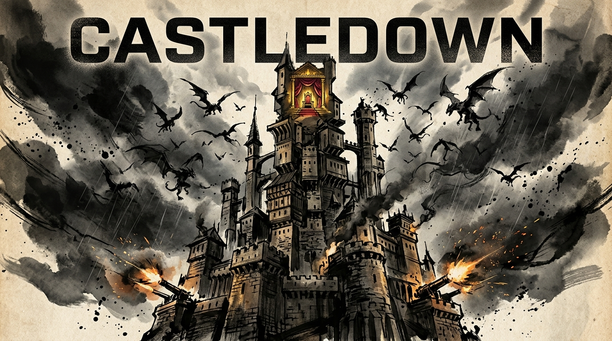

# 🏰 CASTLEDOWN

> **A Physics-Based Castle Stacker & Vertical Tower Defense**  
> Built in 48 hours for **Slapjam AI** • Theme: **"Castles"** *(Build one, storm one, defend one)*



---

## ⚔️ The Hook

**What happens when *Tricky Towers* meets vertical *Tower Defense*?**

In **Castledown**, you are the master architect defending a precarious kingdom. Stack modular castle rooms higher and higher into the storm-swept sky with realistic 2D gravity and balance physics. But this is no peaceful builder—enemy siege engines assault your foundation, and terrifying winged gargoyles swoop down to topple your upper ramparts!

Your defense towers **only fire when stable**. Keep your castle balanced, withstand the siege, and crown your fortress in a nail-biting final countdown to victory!

---

## 🎮 How to Play

### 📱 One-Thumb Touch & Mouse Controls
* **Aim**: Drag horizontally across the screen to position the crane.
* **Rotate**: Tap the **Rotate** button (or press **R**) to turn rooms 90°.
* **Drop**: Tap **DROP ROOM** (or press **Space**) to release the block into gravity.
* **Select Room**: Tap any card in the bottom dock (or press **1–4**).

### ⌨️ Desktop Keyboard Shortcuts
| Key | Action |
|:---:|:---|
| **← / →** or **A / D** | Aim dropper crane left / right |
| **R** | Rotate current room 90° |
| **Space** | Drop room |
| **1 – 4** | Select Stone Wall / Archer / Cannon / Throne |
| **M** | Toggle sound mute |
| **H** | Open / close help guide |
| **Esc** | Close any active modal |

---

## 🧱 Castle Rooms & Tactical Synergy

| Room | Mass | HP | Role & Tactical Ability |
|:---|:---:|:---:|:---|
| **Stone Wall** | 12 t | 300 | **Heavy Foundation.** Wide, high friction, and durable. Shields the base from ground rams. |
| **Archer Tower** | 6 t | 160 | **Anti-Air Watchtower.** Rapidly shoots glowing arrows at swooping Gargoyles. Ramping shape challenges vertical balance! |
| **Cannon Balcony** | 10 t | 160 | **Heavy Artillery.** Lobs explosive ballistic mortar shells at ground rams. Asymmetric overhang tests your center of mass! |
| **King’s Chamber** | 14 t | 180 | **The Royal Crown.** Locked until your tower reaches the target height. Place it at the peak to trigger the Coronation! |

> [!IMPORTANT]
> **The Stability Rule**: Archer Towers and Cannon Balconies **ONLY reload and fire when STABLE** (green aura). If your castle wobbles or tilts into the yellow/red zone, your defenders panic and cannot aim!

---

## 🦅 The Threats

* **Winged Gargoyles (Air Threat)**: Triggered every 10 meters of height. They swoop down from the storm clouds to strike fragile upper rooms, delivering physical impact forces that can knock over top-heavy towers.
* **Battering Rams (Ground Threat)**: Advance from the ground edges to batter your lowest walls, dealing heavy structural damage and sending shockwaves up the tower.

---

## 👑 The "Coronation" Victory Loop

1. **Climb to the Finish Line**: Stack your castle to reach the stage's target height line (15m, 25m, 35m).
2. **Crown the Castle**: Once reached, the golden **King's Chamber unlocks**. Place it carefully on your highest stable room.
3. **Survive the 10-Second Coronation Swarm**: When the King's Chamber lands and stabilizes, a **10-second countdown begins** as a furious Gargoyle Swarm attacks!
4. **Victory!**: If the King stays stable until the timer hits zero, **the stage is won!** Earn stars based on survival, speed, and structural integrity.

---

## 🗺️ Campaign Stages

* **Level 1 — The First Stone** (Target: 15 m • 8s Coronation)  
  *Learn the fundamentals: build a sturdy base, deploy early archers against scout gargoyles, and crown your first castle.*
* **Level 2 — Siege of Rams** (Target: 25 m • 10s Coronation)  
  *Ground battering rams assault your foundation while aerial gargoyles swarm from above. Requires careful balance between cannon balconies and archer watchtowers.*
* **Level 3 — The Final Climax** (Target: 35 m • 12s Coronation)  
  *Tougher siege engines, intense aerial swarms, and high-altitude winds. The ultimate test of architectural defense.*
* **Endless Mode — Sky Citadel** (Target: 45 m + 10 m each siege)  
  *Unlocked after completing Level 3. Test how high you can build against escalating infinite siege waves!*

---

## ✨ Features & Polish

* **Pure Procedural Visuals**: Dynamic masonry textures, stone cracks, battlements, warm glowing windows, floating dust particles, and muzzle smoke—zero external image dependencies.
* **Synthesized Web Audio**: Custom synthesized sound effects (stone thuds, bow twangs, cannon blasts, crown chimes, and victory fanfares) using Web Audio API.
* **Mobile-Portrait Responsive**: Native 720 × 1280 portrait resolution scaled cleanly with letterboxing on any phone or desktop browser.
* **Persistent Progress**: Best height, star ratings, and high scores automatically save to `localStorage`.

---

## 🚀 Quick Start (Local Development)

```sh
# Install dependencies
npm install

# Start local dev server with hot reload
npm run dev

# Run automated tests
npm test

# Build and package for itch.io
npm run pack
```

---

## 📦 itch.io Upload Guide

1. Run `npm run pack` to generate the production zip at `artifacts/castledown-itch-v1.0.0.zip`.
2. On your **itch.io** game edit page:
   * **Kind of project**: `HTML`
   * Upload `castledown-itch-v1.0.0.zip` and tick **"This file will be played in the browser"**.
   * **Viewport dimensions**: `720` × `1280`
   * Check **Mobile friendly** (Orientation: Portrait) and **Fullscreen button**.

---

## 🤖 AI Tools Used

| Area | Tool | Notes |
| --- | --- | --- |
| Code | GPT 6 Astra, Claude 5.5 Opus | Gameplay systems, balancing, debugging, and tests, with human review |
| Art | — (procedural) | All sprites, masonry, and backgrounds are generated at runtime on canvas (`BootScene`); no AI-generated or external art |
| Audio | — (procedural) | All SFX are synthesized in code (`audioSynth.ts`); no AI-generated or external samples |
| 3D | — | No 3D; the game is 2D canvas |

---

## 📜 Credits

Created for **Slapjam AI 2026** (48-Hour Sprint)  
**Theme:** *Castles* — Build one, storm one, defend one.
